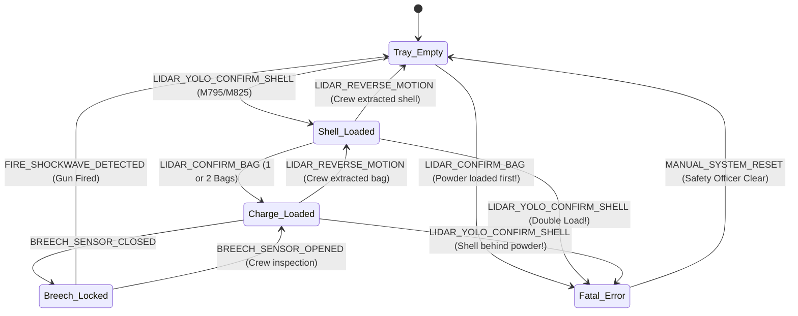

```mermaid
stateDiagram-v2
    [*] --> Tray_Empty
    Tray_Empty --> Shell_Loaded : LIDAR_YOLO_CONFIRM_SHELL (M795/M825)
    Tray_Empty --> Fatal_Error : LIDAR_CONFIRM_BAG (Powder loaded first!)
    Shell_Loaded --> Charge_Loaded : LIDAR_CONFIRM_BAG (1 or 2 Bags)
    Shell_Loaded --> Fatal_Error : LIDAR_YOLO_CONFIRM_SHELL (Double Load!)
    Shell_Loaded --> Tray_Empty : LIDAR_REVERSE_MOTION (Crew extracted shell)
    Charge_Loaded --> Breech_Locked : BREECH_SENSOR_CLOSED
    Charge_Loaded --> Shell_Loaded : LIDAR_REVERSE_MOTION (Crew extracted bag)
    Charge_Loaded --> Fatal_Error : LIDAR_YOLO_CONFIRM_SHELL (Shell behind powder!)
    Breech_Locked --> Tray_Empty : FIRE_SHOCKWAVE_DETECTED (Gun Fired)
    Breech_Locked --> Charge_Loaded : BREECH_SENSOR_OPENED (Crew inspection)
    Fatal_Error --> Tray_Empty : MANUAL_SYSTEM_RESET (Safety Officer Clear)
```

